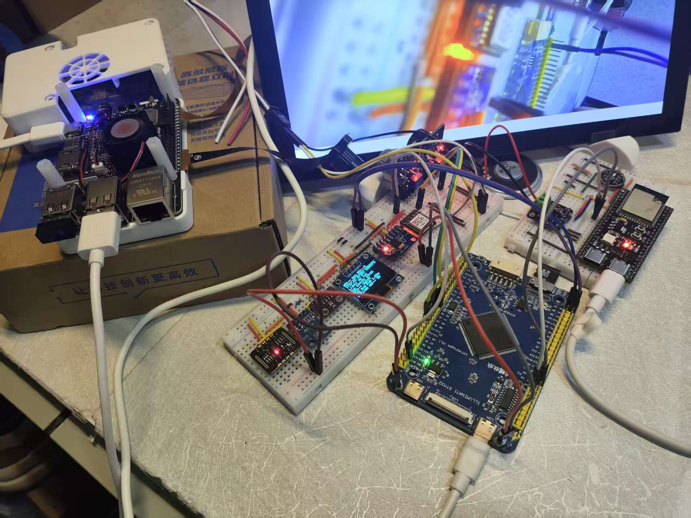
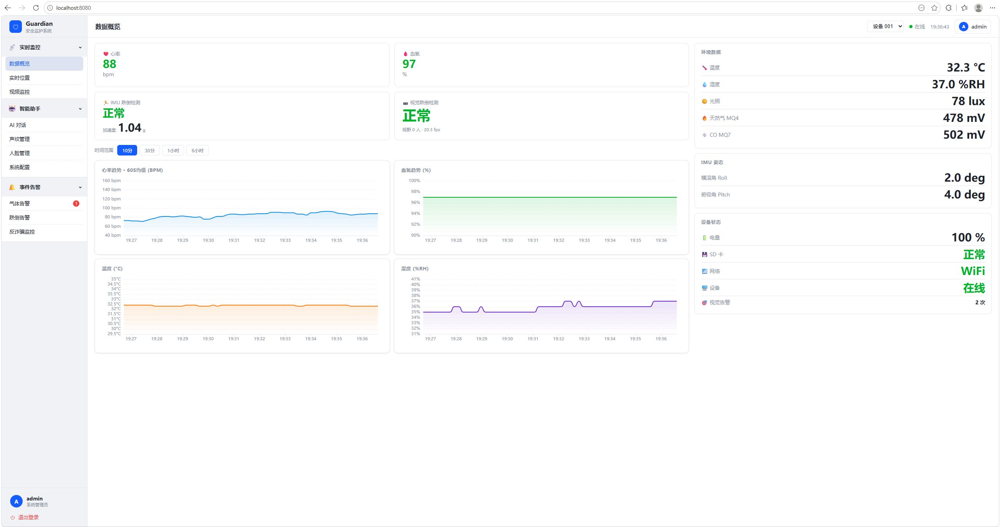
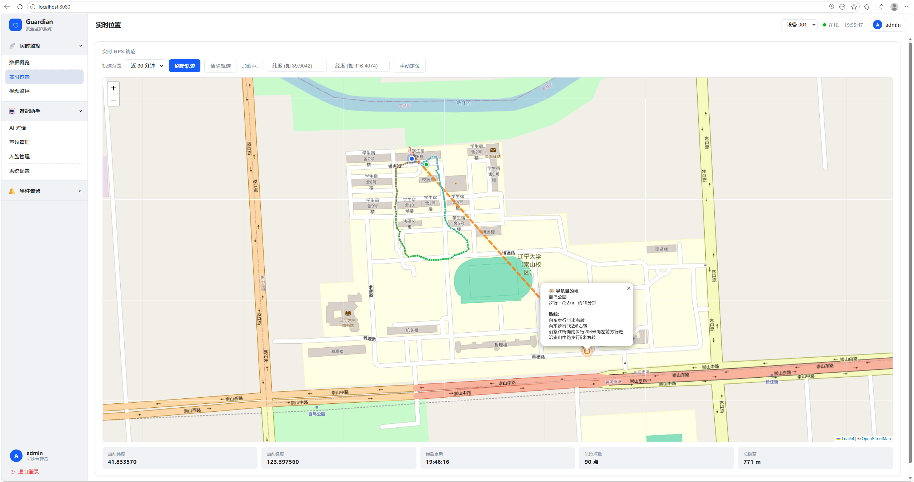
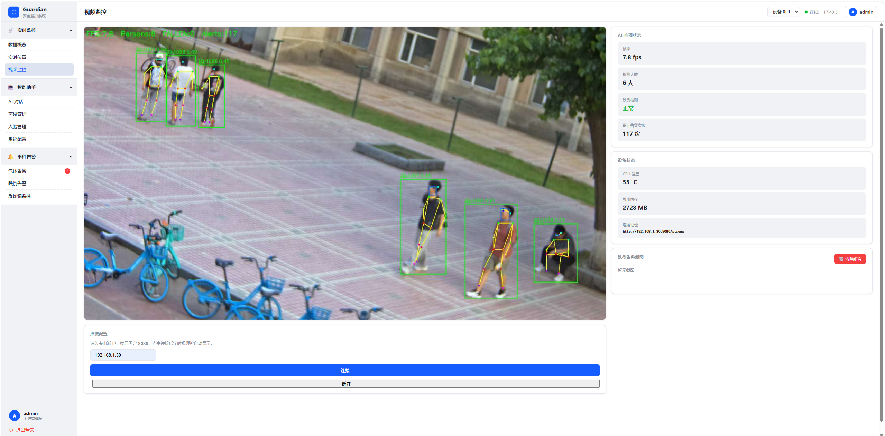
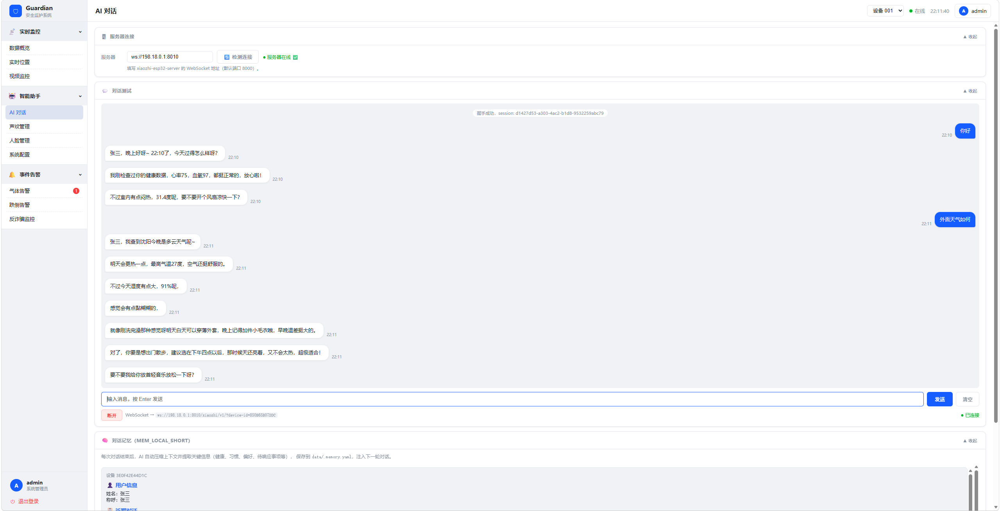

<div align="center">

# Guardian — 智能安全监护系统

**面向独居老人和残障人士的多平台智能监护系统**

整合视觉 AI、语音交互、多路传感器与云端看板，覆盖跌倒检测、反诈骗监听、生理健康监测、AI 语音助手、家属实时告警等场景。


</div>

---

## 效果展示

<div align="center">

<br/><sub>硬件连接 — 三平台实物连接</sub>

<br/>

<table>
  <tr>
    <td align="center"><br/><sub>数据概览 — 实时传感器卡片 + 折线图</sub></td>
    <td align="center"><br/><sub>实时位置 — GPS 轨迹 + Leaflet 地图</sub></td>
  </tr>
  <tr>
    <td align="center"><br/><sub>视频监控 — MJPEG 视频流 + AI 推理状态</sub></td>
    <td align="center"><br/><sub>AI 语音助手 — 大模型对话 / TTS / 记忆管理</sub></td>
  </tr>
</table>

</div>

### 跌倒检测演示

<div align="center">

<video src="image/result_vedio/fall_result_low.mp4" width="640" controls muted loop>
  跌倒检测演示视频
</video>

</div>

---

## 核心创新

- **双冗余跌倒检测**：视觉（YOLOv8n-pose）与 IMU（三阶段 FSM）双模互补，放置/携带模式自适应切换
- **传感器感知增强 AI 对话**：心率、血氧等实时传感器数据注入 LLM 上下文，AI 可回答"我现在心率正常吗"等具身感知问题
- **NPU 多模型并行推理**：RK3576 三核 NPU 同时运行 YOLOv8n-pose / SCRFD+ArcFace / YOLOv8n-det，端到端 ~20 fps
- **反诈骗智能监听**：陌生人声纹检测 + LLM 诈骗话术分析，实时 MQTT 告警推送
- **全链路云端告警**：跌倒/气体告警端到端延迟 0.5~3 s，微信实时推送

---

## 目录
- [两种工作模式](#两种工作模式)
- [功能概览](#功能概览)
- [快速启动](#快速启动)
- [硬件配置](#硬件配置)
- [目录结构](#目录结构)
- [技术栈](#技术栈)

---

## 系统架构

```
STM32F407（传感器 + IMU）
        │ UART 115200
        ▼
ESP32-S3（AI 语音 + MQTT 网关）
        │ WiFi / EMQX Cloud TLS
        ▼
EMQX Cloud Broker（TLS 8883）
        │
        ├──► RK3576 泰山派（摄像头视觉 AI，独立 WiFi 接入）
        │
        └──► PC 云端
               ├── mqtt_subscriber.py → InfluxDB Cloud
               ├── api.py :8001（REST API）
               ├── xiaozhi-esp32-server :8010（AI 语音后端）
               ├── voiceprint_service :8002（声纹识别）
               ├── funasr_http_service.py :10097（本地 ASR）
               └── index.html :8080（前端看板）
```

### 硬件平台

| 板卡 | 芯片 | 主要职责 |
|------|------|---------| 
| 主控板 | STM32F407ZGT6 | 传感器采集、IMU 跌倒检测、SD 卡日志 |
| AI 语音板 | ESP32-S3 N16R8 | 语音对话、WiFi 联网、MQTT 上云、传感器网关 |
| 视觉板 | RK3576（泰山派 3M） | 摄像头跌倒检测、人脸识别、目标检测、MJPEG 推流 |
| 云端 PC | Windows 11 | AI 后端、InfluxDB、前端看板、声纹识别 |

---

## 两种工作模式

### 🏠 放置模式（摄像头固定）

- 摄像头视野稳定，持续监测居家环境
- **视觉跌倒检测**：YOLOv8n-pose 姿态估计 + 速度特征 + 三阶段状态机（NPU Core 0，~20 fps）
- **人脸识别**：SCRFD-500M-KPS + MobileNet ArcFace，识别家庭成员；陌生人触发告警
- **反诈骗监听**：检测到陌生人时自动开启麦克风监听，本地规则引擎分析对话内容，MQTT 上报

### 🚶 携带模式（随身携带）

- 摄像头随身晃动，停用视觉跌倒检测
- **IMU 跌倒检测**：MPU6050 三轴加速度，三阶段状态机（自由落体 → 撞击 → 静止确认）
- **目标检测辅助**：YOLOv8n-det（NPU Core 2），辅助视障人士识别障碍物、红绿灯等
- GPS 实时轨迹 + AI 导航辅助

---

## 功能概览

### 👁️ 视觉感知（RK3576）

| 功能 | 状态 |
|------|------|
| 摄像头跌倒检测（放置模式） | ✅ 已完成 |
| 人脸检测 + 识别（SCRFD + ArcFace） | ✅ 已完成 |
| 身份锁定缓存（track_id，恢复 FPS ~20） | ✅ 已完成 |
| MJPEG 视频推流（前端直接接入） | ✅ 已完成 |
| 陌生人告警 + 反诈骗监听 | ✅ 已完成 |
| 携带模式目标检测（YOLOv8n-det） | ✅ 已完成 |
| 网页人脸录入接口（/enroll、/face_db） | ✅ 已完成 |
| 告警截图存档（含时间戳和姓名） | ✅ 已完成 |

### 🎤 AI 语音交互（ESP32-S3 + xiaozhi-server）

| 功能 | 状态 |
|------|------|
| 按键唤醒（BOOT 键） | ✅ 已完成 |
| 语音识别 ASR（FunASR SenseVoiceSmall，本地） | ✅ 已完成 |
| 大模型对话（qwen-flash，function_call 工具调用） | ✅ 已完成 |
| 语音合成 TTS（火山引擎双流 WSS，边生成边播放） | ✅ 已完成 |
| 噪声抑制（AFE NSNet 神经网络降噪） | ✅ 已完成 |
| 传感器数据注入 LLM（AI 可回答"我心率多少"） | ✅ 已完成 |
| 唤醒词检测（WakeNet，框架就绪） | 🔧 基本完成 |
| 回声消除 AEC（框架就绪，待实机验证） | ⏳ 待验证 |

### 💓 生理健康监测（STM32F407）

MAX30102 心率 + 血氧 / BME280 温湿度气压 / MQ-4 甲烷 / MQ-7 一氧化碳 / BH1750 光照 / ATGM336H GPS

### 🏃 运动监测（STM32F407）

MPU6050 姿态解算 + 三阶段跌倒状态机（携带模式）

### ☁️ 云端平台（PC）

| 功能 | 状态 |
|------|------|
| MQTT TLS 接收（EMQX Cloud 8883） | ✅ 已完成 |
| InfluxDB 时序存储（全传感器 + 告警） | ✅ 已完成 |
| 微信告警推送（Server酱，60s 冷却） | ✅ 已完成 |
| REST API（FastAPI :8001，历史查询 + 快照） | ✅ 已完成 |
| 声纹识别服务（resemblyzer 256 维，:8002） | ✅ 已完成 |
| 传感器快照注入 AI 上下文（/api/sensor-snapshot） | ✅ 已完成 |

### 🖥️ 前端看板（Web :8080）

| 页面 | 内容 |
|------|------|
| 数据概览 | 心率/血氧/温湿度/气体实时卡片 + 折线图（支持 15分/1h/6h/24h） |
| 告警历史 | 告警列表，支持类型过滤 |
| GPS 地图 | Leaflet + OpenStreetMap，实时轨迹 |
| 视觉监控 | MJPEG 视频流 + AI 推理状态 + 跌倒截图面板 |
| AI 助手 | TTS 音色/Prompt/记忆管理 + WebSocket 文字对话测试 |
| 声纹注册 | 浏览器录音 / 上传注册 + 说话人管理 |
| 人脸库管理 | 拖拽上传录入、人脸列表、删除（对应泰山派 /enroll 接口） |

---

## 关键指标

| 平台 | 指标 | 数值 |
|------|------|------|
| STM32F407 | Flash / RAM 占用 | 221.93 KB / 26.39 KB（21.7% / 13.7%） |
| STM32F407 | I2C 通信成功率 | 100%（4 路传感器，各 100 次） |
| ESP32-S3 | 固件大小 | 1.82 MB（余量 11%） |
| ESP32-S3 AI | ASR 准确率 | ≥95%（安静环境） |
| ESP32-S3 AI | 端到端首帧延迟 | 1.2~1.8 s（ASR+LLM+TTS） |
| RK3576 | 视觉推理帧率 | ~20 fps（NPU 零拷贝管线） |
| RK3576 | 跌倒检测准确率 | 96%（50 Ways to Fall 测试集） |
| 全系统 | 告警端到端延迟 | 0.5~3 s（检测→微信推送） |

---

## 快速启动

### 前置条件

- Windows 11 + Python 3.12 conda 环境 `xiaozhi-esp32-server`
- InfluxDB Cloud 账号（免费版）
- EMQX Cloud TLS Broker（免费版）
- 火山引擎 TTS AppID + Access Token
- 阿里云百炼 API Key（qwen-flash）
- ffmpeg 已加入系统 PATH（声纹服务依赖）

### 配置文件

**`guardian_server/main/xiaozhi-server/data/.config.yaml`** — AI 服务核心配置（TTS Token、LLM Key、声纹服务地址、WebSocket IP）

**`guardian_cloud/backend/.env`**（从 `.env.example` 复制）：
```
MQTT_BROKER=<EMQX Cloud 地址>
MQTT_PORT=8883
INFLUX_URL=https://...influxdata.com
INFLUX_TOKEN=...
INFLUX_ORG=...
INFLUX_BUCKET=guardian
SERVERCHAN_KEY=...   # 微信推送，可选
```

### 修改服务器 IP

编辑 `start_all.bat` 顶部两行：
```bat
set TAISHAN_IP=192.168.1.26   ← 泰山派实际 IP
set PC_IP=192.168.1.16        ← 本机实际 IP
```
脚本会自动更新 `.config.yaml` 中的 WebSocket 地址。

### 启动所有服务

```bat
start_all.bat
```

启动顺序：声纹服务（:8002）→ MQTT 订阅 → REST API（:8001）→ AI 语音（:8010）→ 前端（:8080）→ FunASR（:10097）

浏览器访问：`http://localhost:8080`

### 端口分配

| 端口 | 服务 |
|------|------|
| 8001 | REST API（FastAPI） |
| 8002 | 声纹识别服务 |
| 8010 | xiaozhi-esp32-server（AI 语音 WebSocket） |
| 8080 | 前端看板（静态文件） |
| 10097 | FunASR HTTP 服务（本地 ASR） |

---

## 硬件配置

### ESP32-S3 WiFi / 服务器地址更新

修改 `guardian_esp32_ai/wifi_config.csv`，重新生成并烧录 NVS（无需重新编译固件）：

```bash
python $IDF_PATH/components/nvs_flash/nvs_partition_generator/nvs_partition_gen.py \
    generate wifi_config.csv wifi_nvs.bin 0x6000

esptool.py --chip esp32s3 --port COM12 write_flash 0x9000 wifi_nvs.bin
```

### 泰山派 FunASR 地址更新

```bash
ssh lckfb@<TAISHAN_IP> "sed -i 's|http://[0-9.]*:10097/asr|http://<PC_IP>:10097/asr|g' ~/rknn/zerocopy/pipeline_zerocopy.py"
```

### 人脸录入

通过前端"人脸库管理"页面上传，或直接调用接口：

```bash
# 录入
curl -X POST http://<TAISHAN_IP>:8080/enroll -F "name=张三" -F "file=@face.jpg"
# 查看
curl http://<TAISHAN_IP>:8080/face_db
# 删除
curl -X DELETE http://<TAISHAN_IP>:8080/face_db/张三
```

### 声纹注册

通过前端"声纹注册"页面录音上传，或离线脚本注册：

```bash
python guardian_server/voiceprint_service/register.py <音频.wav>
```

---

## 目录结构

```
embedded_design_competition/
├── guardian_f407/              # STM32F407 RT-Thread 固件
│   └── applications/           # 业务代码（传感器、跌倒检测、OLED、LED）
├── guardian_esp32_ai/          # ESP32-S3 ESP-IDF 固件
│   ├── main/                   # 应用代码（音频、WebSocket、传感器网关）
│   └── wifi_config.csv         # WiFi / WebSocket 地址配置（修改后生成 NVS bin 烧录）
├── guardian_taishanpi/         # RK3576 泰山派视觉 AI
│   └── rknn/
│       ├── zerocopy/
│       │   └── pipeline_zerocopy.py  # 主推理流水线（放置模式）
│       ├── pipeline_carry.py         # 携带模式目标检测
│       └── face_db/                  # 已注册人脸特征库
├── guardian_server/            # PC 端 AI 语音服务
│   ├── main/xiaozhi-server/    # xiaozhi-esp32-server（第三方，含二次开发）
│   │   └── data/.config.yaml   # 运行时配置（TTS/ASR/LLM/声纹）
│   ├── voiceprint_service/     # 声纹识别服务（:8002）
│   └── funasr_http_service.py  # FunASR HTTP 服务（:10097）
├── guardian_cloud/             # PC 端云端服务 + 前端
│   ├── backend/
│   │   ├── api.py              # REST API（:8001）
│   │   └── mqtt_subscriber.py  # MQTT 订阅 + InfluxDB + 微信推送
│   └── frontend/
│       └── index.html          # 单文件前端看板
├── image/                      # README 展示图片与演示视频
├── start_all.bat               # 一键启动脚本（Windows）
└── docs/                       # 开发文档（gitignore，本地保留）
```

---

## 技术栈

| 层 | 技术 |
|----|------|
| 嵌入式固件 | RT-Thread（STM32F407）/ ESP-IDF v5.5.1（ESP32-S3） |
| 视觉 AI | RKNNLite NPU，YOLOv8n-pose / SCRFD / ArcFace / YOLOv8n-det |
| 语音 AI | FunASR SenseVoiceSmall（ASR）/ qwen-flash（LLM）/ 火山引擎 HuoshanDoubleStreamTTS |
| 音频协议 | Opus 60ms 帧（DTX + VBR）/ OGG 解封装 / WebSocket 二进制 v3 |
| 数据存储 | InfluxDB Cloud（时序）/ JSON Lines（SD 卡日志） |
| 消息传输 | EMQX Cloud MQTT TLS 8883 |
| 后端 | FastAPI Python 3.12 / paho-mqtt / resemblyzer（声纹）|
| 前端 | 原生 HTML/JS / ECharts 5 / Leaflet 1.9 |

---

## 开源协议

本项目基于 [MIT License](LICENSE) 开源。

---

## 致谢

- **RT-Thread**：[https://github.com/RT-Thread/rt-thread](https://github.com/RT-Thread/rt-thread)
- **xiaozhi-esp32**：[https://github.com/78/xiaozhi-esp32](https://github.com/78/xiaozhi-esp32)
- **xiaozhi-esp32-server**：[https://github.com/xinnan-tech/xiaozhi-esp32-server](https://github.com/xinnan-tech/xiaozhi-esp32-server)
- **Ultralytics YOLOv8**：[https://github.com/ultralytics/ultralytics](https://github.com/ultralytics/ultralytics)
- **rknn-toolkit2**：[https://github.com/airockchip/rknn-toolkit2](https://github.com/airockchip/rknn-toolkit2)
- **FunASR**：[https://github.com/modelscope/FunASR](https://github.com/modelscope/FunASR)
- **Resemblyzer**：[https://github.com/resemble-ai/Resemblyzer](https://github.com/resemble-ai/Resemblyzer)
- **FastAPI**：[https://github.com/fastapi/fastapi](https://github.com/fastapi/fastapi)
- **ECharts**：[https://github.com/apache/echarts](https://github.com/apache/echarts)
- **Leaflet**：[https://github.com/Leaflet/Leaflet](https://github.com/Leaflet/Leaflet)

---

## 联系方式

- **Issues**：[项目 Issues 页面](https://github.com/hpy666666/guardian-ai-assistant/issues)

---

## Star History

[](https://star-history.com/#hpy666666/guardian-ai-assistant&Date)
